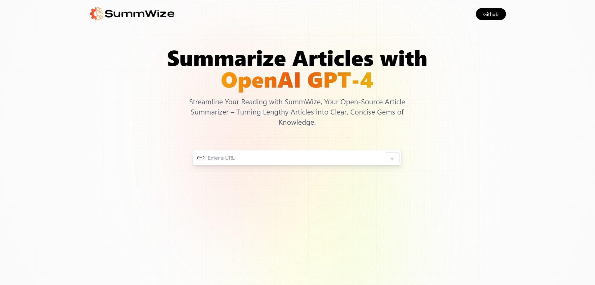
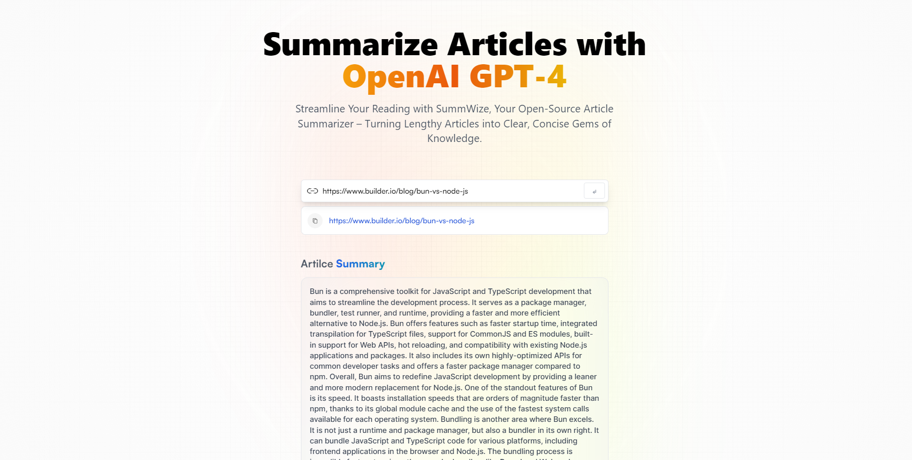
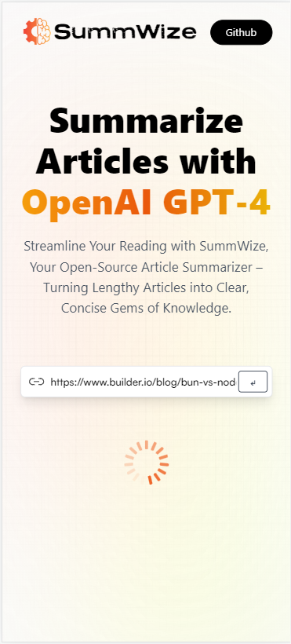
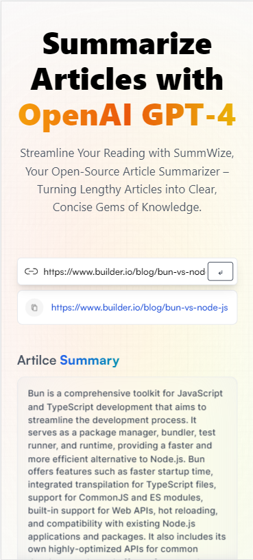

# Summwiz Web App

## Overview

Summwiz is an open-source web application that allows users to summarize articles and web content into clear and concise summaries. It simplifies reading and helps users quickly understand the main points of lengthy articles.

## Features

- Enter a URL to summarize articles.
- View a history of previously summarized articles.
- Copy summarized article URLs to the clipboard.

## Screenshots

  
  

## Getting Started

Follow these steps to set up and run the Summwiz web app locally:

1. Clone the repository: `git clone https://github.com/yourusername/summwiz-web.git`
2. Install dependencies: `npm install`
3. Start the development server: `npm start`

## Usage

1. Open the web app in your browser.
2. Enter a URL in the input field and click the "Summarize" button.
3. View the summarized article and copy the URL if needed.

## Contributing

If you'd like to contribute to Summwiz, please follow our [contribution guidelines](CONTRIBUTING.md).

## License

This project is licensed under the MIT License - see the [LICENSE](LICENSE) file for details.

## Acknowledgments

- Thanks to [RapidAPI](https://rapidapi.com) for providing the article summarization API.

## Contact

For questions or feedback, please contact [Your Name](mailto:youremail@example.com).

